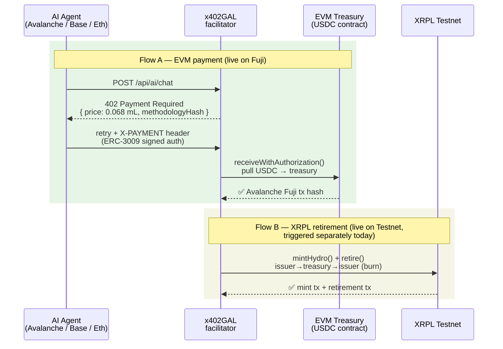
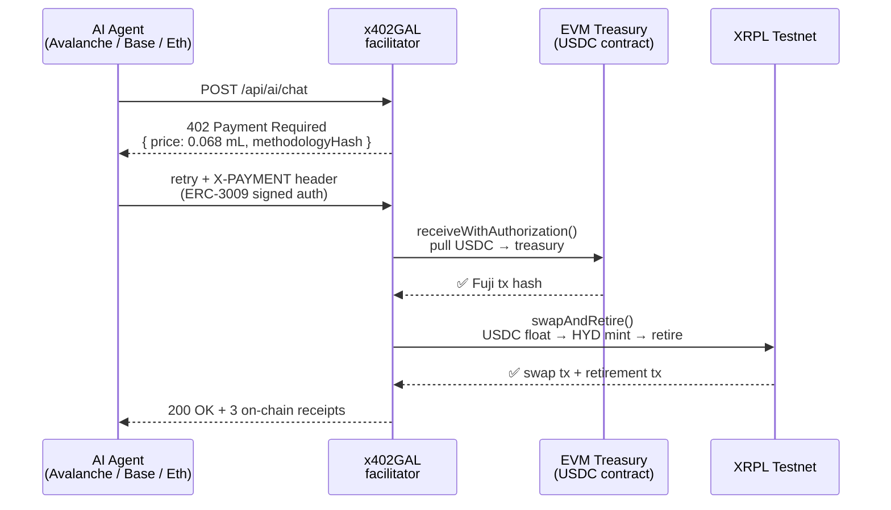

# x402GAL — Water-offset rails for AI agents

[](LICENSE)
[](README.md#disclaimer)
[](https://www.x402.org/)
[](https://testnet.xrpscan.com)
[](https://testnet.avascan.info)
[](tsconfig.json)

> Every AI inference consumes freshwater. x402GAL charges agents per call in USDC and retires **HydroCoin (HYDRO)** water-restoration credits on **XRPL** — fully on-chain, no intermediary.

**1 billion AI calls/day = 68 L of freshwater** — currently with zero accountability. x402GAL makes that externality programmable using primitives that already exist: x402, USDC, and XRPL.

> ⚠️ **Testnet demo only.** This is an independent hackathon-derived project. Water credits are tied to [HydroCoin's MRV Framework](https://hydrocoin.com/whitepaper) but currently issued under a custodial model. Not financial advice. No real-world carbon/water offsets are guaranteed.

> **Disclaimer:** Funds on testnet have no real-world value. HydroCoin water credits are backed by the [HydroCoin MRV Framework](https://hydrocoin.com/whitepaper). Currently operates under a custodial issuance model during testnet phase; transitioning toward decentralized verification aligned with HydroCoin's MRV roadmap.

---

## Quick start

```bash
# 1. Install
npm install

# 2. Configure (copy and fill in your seeds — see Configuration below)
cp env.local.example .env.local

# 3. Run (Next.js app)
npm run dev        # → http://localhost:3000
npm run build      # production build
```

To run a paying agent against the live server:

```bash
npm run demo:agent
```

---

## How it works

### Current architecture (two independent flows)

EVM payment and XRPL retirement currently run as separate demonstrations. The cross-chain trigger (Fuji confirmation → XRPL retire from float) is scoped but not yet wired.



> **On-ledger note:** The XRPL flow mints HYD from the issuer to the treasury, then returns it to the issuer (burned). There is no USDC↔HYD swap on-chain today; the treasury float is managed off-ledger. A DEX-based swap is on the mainnet roadmap.

### Intended unified architecture (planned)



---

## Verified on-chain proof

End-to-end run **live demo (updated May 2026)** — real funds, two chains:

| # | Action | Chain | Transaction |
|---|---|---|---|
| 1 | USDC pulled via ERC-3009 | Avalanche Fuji | [0xb881…7032](https://testnet.avascan.info/blockchain/c/tx/0xb88104cab2344fe38f0e00fa1bcdb041e730a1f61f45928a6ed64b23c6f17032) |
| 2 | HYD mint (issuer → treasury) | XRPL testnet | [5484EC…CB15](https://testnet.xrpscan.com/tx/5484EC649181ABE68DB1EE252F55A312520BC52C64162D5DEBEE9A5CF205CB15) |
| 3 | HYD retirement (water credit) | XRPL testnet | [4E4795…DB41](https://testnet.xrpscan.com/tx/4E479597A44755318B938DC1432C478C38302440482BCB0CA5EFE8976BDADB41) |

---

## Integration

### Drop-in agent fetch

*Use this if you are building an AI agent that needs to auto-pay 402s.*

```ts
import { x402galFetch } from "@/lib/agentSdk";

// Automatically handles 402 → sign → retry
const res = await x402galFetch("https://your-app.com/api/ai/chat", {
  method: "POST",
  body: JSON.stringify({ prompt: "What is water scarcity?" }),
  payerPrivateKey: process.env.AGENT_PRIVATE_KEY,
  chain: "avalanche",
});
```

### Plug into any x402-hono resource server

*Use this if you are adding x402 payment gating to your own API server.*

```ts
import { xrplVerify, xrplSettle } from "./lib/x402XrplAdapter";
import { paymentMiddleware } from "x402-hono";

app.use("/api/*", paymentMiddleware(priceInUsdc, {
  verify: xrplVerify,
  settle: xrplSettle,
}));
```

### Facilitator endpoint

*Use this if you want to call the x402GAL facilitator directly from any language or stack.*

```
POST https://your-deploy.com/api/x402/facilitate
Body: { requirement: X402Requirement, payload: X402Payload }

Response 200:
{
  usdcPulled: true,
  usdcTxHash: "0xb881...",          // Avalanche Fuji
  txHash: "5484EC...",              // XRPL mint
  retirementTxHash: "4E4795...",    // XRPL water credit
  simulated: false                    // false = on-chain tx submitted; does not imply a DEX swap occurred
}
```

---

## Configuration

> **⚠️ Security:** Never commit real seeds or private keys. Use `.env.local` (already gitignored) and [GitHub Secrets](https://docs.github.com/en/actions/security-guides/encrypted-secrets) for CI/deployments. Use a secrets manager (Doppler, Vault) in production.

Copy `env.local.example` → `.env.local` and fill in:

| Variable | Required | Description |
|---|---|---|
| `XRPL_ENDPOINT` | ✅ | XRPL node WebSocket (`wss://s.altnet.rippletest.net:51233`) |
| `XRPL_TREASURY_SEED` | ✅ | Treasury (hot) wallet seed *(never commit!)* |
| `HYDROCOIN_ISSUER_SEED` | ✅ | Issuer (cold) wallet seed *(never commit!)* |
| `HYDROCOIN_ISSUER` | ✅ | Issuer wallet address |
| `HYDROCOIN_CURRENCY` | ✅ | Currency code (`HYD`) |
| `EVM_TREASURY_PRIVATE_KEY` | ✅ | Treasury EVM key *(use `.env.local` + secret manager in production)* |
| `EVM_TREASURY_ADDRESS` | ✅ | Treasury EVM address |
| `AVALANCHE_NETWORK` | optional | `fuji` (default) or `mainnet` |
| `RPC_BASE` / `RPC_ETHEREUM` / `RPC_POLYGON` / `RPC_AVALANCHE` | optional | EVM RPC endpoints — public fallback used if absent |

---

## Footprint model — v2 boundary-aware WUE

```
W_site = WUE_site × [(T_in/1000)·e_in + (T_out/1000)·e_out + e_overhead] × F_boundary
```

Follows [Green Grid WUE v1](https://www.thegreengrid.org/) strictly — no double-counted cooling, GPU-boundary aware. Every `402` response embeds the full methodology block so auditors can re-derive the price independently.

**Defaults:** WUE 0.20 L/kWh · 200-in/500-out GPT-4-class call = **0.068 mL ≈ 18 HYDRO sub-units**

> **Note on units:** "HYDRO sub-units" are the smallest HYD denomination (analogous to cents), where 1 HYDRO = 1 US gallon of water restoration credit. We avoid the term "drops" here to prevent confusion with XRP drops (XRP's native smallest unit).

Methodology hash pinned at: [`sha256:7f27acc35d4e67bd50b60e894c30c51932d2318c6bc20ca8f38413d03122b6f0`](https://hydrocoin.com/whitepaper) — verify against the [HydroCoin MRV Framework](https://hydrocoin.com/whitepaper) to re-derive independently.

---

## Roadmap

| Milestone | Status |
|---|---|
| x402 v1 exact scheme over HTTP | ✅ |
| v2 boundary-aware WUE footprint model | ✅ |
| Batching / settlement state machine | ✅ |
| Multi-chain RPC verification (EVM via viem) | ✅ |
| EVM treasury `receiveWithAuthorization` | ✅ |
| XRPL testnet mint + retire (real txs) | ✅ |
| Avalanche Fuji ↔ mainnet network switching | ✅ |
| Full ERC-3009 agent-side signing SDK | 🔄 |
| Solana SPL token verification | 📋 |
| XRPL signature verification (ripple-keypairs) | 📋 |
| XRPL DEX swap replacing in-memory AMM | 🚀 Mainnet |
| Decentralized methodology oracle / DAO | 🚀 Mainnet |

---

## Project structure

| Path | Role |
|---|---|
| `lib/x402.ts` | x402 v1 "exact" scheme — requirement builder, payload codec, verifier |
| `lib/chainVerifier.ts` | Multi-chain RPC verifier — EVM (viem + ERC-3009 nonce), Solana/XRPL stubs |
| `lib/evmTreasury.ts` | EVM treasury — pulls USDC via `receiveWithAuthorization` |
| `lib/x402XrplAdapter.ts` | x402 XRPL network adapter — `verify()` + `settle()` interface |
| `lib/settlement.ts` | Batch flush → XRPL swap + retire |
| `lib/amm.ts` | Constant-product AMM (x·y=k) — USDC→HYDRO price + scarcity |
| `lib/footprint.ts` | v2 WUE footprint model with pinned methodology hash |
| `lib/agentSdk.ts` | `x402galFetch()` — drop-in `fetch()` that auto-pays 402s |
| `lib/ledger.ts` | In-memory ledger — agents, settlements, AMM, pending batch |
| `app/api/ai/chat` | x402-gated demo inference endpoint |
| `app/api/x402/facilitate` | XRPL facilitator endpoint (EVM pull + XRPL settle) |
| `app/api/x402/verify` | Standalone facilitator (pluggable into any resource server) |
| `components/Dashboard.tsx` | Live dashboard — throughput, settlement stream, AMM chart |

---

## Intellectual Property

x402GAL — the application, the brand, and the code in this repository — belongs to the HydroCoin project. HydroCoin (HYD) and the MRV framework are the property of the HydroCoin project. Built by Edge Consulting Labs.

The application code in this repository is released under the MIT license.

---

## Contributing

See [CONTRIBUTING.md](CONTRIBUTING.md) for open tasks including full XRPL signature verification and agent-side ERC-3009 signing.

## License

x402GAL application: [MIT](LICENSE) © 2026 the HydroCoin project.

Built by Edge Consulting Labs.
